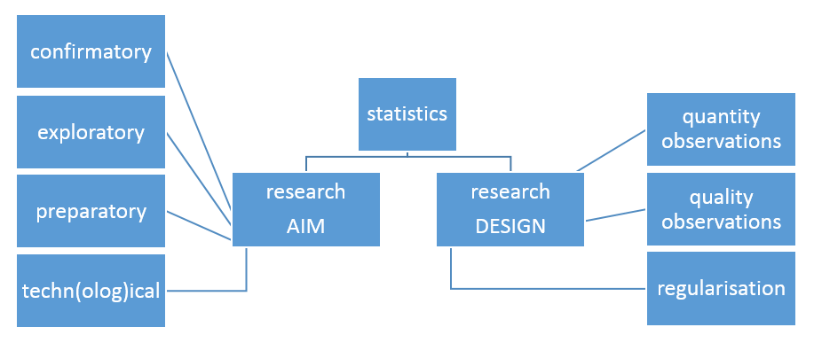
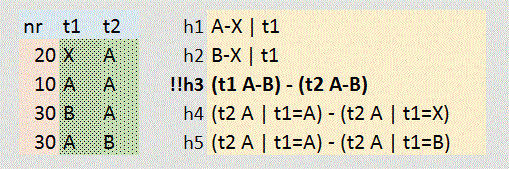

<style type="text/css">

body{ /* Normal  */
      font-size: 12px;
  }
td {  /* Table  */
  font-size: 8px;
}
h1.title {
  font-size: 38px;
  color: DarkRed;
}
h1 { /* Header 1 */
  font-size: 28px;
  color: DarkBlue;
}
h2 { /* Header 2 */
    font-size: 22px;
  color: DarkBlue;
}
h3 { /* Header 3 */
  font-size: 18px;
  font-family: "Times New Roman", Times, serif;
  color: DarkBlue;
}
code.r{ /* Code block */
    font-size: 12px;
}
pre { /* Code block - determines code spacing between lines */
    font-size: 14px;
}
</style>

<!--

ICDS website:
how to communicate your methodology and statistics in a research proposal

	Goal: 
	tips writing research proposals

	Wilfried Cools
	statistical consultant ICDS
	wilfried.cools@vub.be
	02 477 44 44

-->

```{r global_options, include=FALSE}
knitr::opts_chunk$set(echo=FALSE, message=FALSE, warning=FALSE, fig.width=12, fig.height=6)
```

```{r x_lib, echo=F}
```

<!-- RUN:: working directory and libraries -->
```{r x_wd, echo=FALSE}
setwd("C:\\Users\\wcools\\Documents\\ICDS\\website\\drafts")
```

<!-- Sys.setenv(RSTUDIO_PANDOC="C:/Program Files/RStudio/bin/pandoc")
setwd("C:\\Users\\wcools\\Documents\\ICDS\\website\\drafts")
fname <- "methodology"
rmarkdown::render(paste0(fname,".Rmd"),output_format=c('html_document'))
rmarkdown::render(paste0(fname,".Rmd"),output_format=c('pdf_document'))
# knitr::purl(paste0(fname,".Rmd"), output=paste0(fname,".r"))
-->


### Why and What
- convince referees (and yourself) that your study will be successful, effective and efficient
- beware that some referees are statisticians, they do not understand your area of expertise
- to help write proposals statistician proof, a document was created (pdf/html): 'methodological & statistical issues to communicate in research proposals' which will be updated and refined
- <u>disclaimer</u>: no full coverage is pretended, books have been written on the various topics included in current draft<br>the drafts also reflects our own view, not necessarily the view of all possible referees you come across, so, please use this draft only for guidance and not as an argument or proof of any kind.

## Key Ingredients

- there are two key ingredients in terms of methodology
	- you should specify what is the aim of your study
	- you should introduce how you study is designed to achieve that aim

- aim and design should match, often statistics is required for the match



---

## Research Aim

- the research aim typically is a question that your research can provide answers for, note that questions are not stories, nor a description of results
- when specifying the research questions, be specific, so if the questions are put in general terms also operationalize them
- focus, even though your study will be able to provide many interesting findings, typically the study is designed with a few main questions of primary interest
- for the main questions of interest, specify what the results should be at a minimum to make the study successful, this is used to evaluate whether the study is interesting, and whether the aim can be achieved
- for the remainder, explain all the other possible interesting findings that may and might show, findings that are not required to make the study a success but will nevertheless potentially make the study more interesting
<br/>
- several types of aim can be distinguished, and will be discussed in current draft
	- confirmatory / exploratory / preparatory / techn(olog)ical
	- quantitative / qualitative
	- inferential / descriptive

### Confirmatory (purpose A)
  
- goal:: <strong>confirm</strong> an expected difference, relation, ... <br/>maybe the aim is to establish a difference or a pre-specified certainty on a parameter estimate
- focus:: statistical <strong>test</strong> or accurate parameter estimate
- requirement::
	- <strong>sample size</strong> calculation, if not enough information is obtained to make the confirmation the study failed
		- absence of proof is not proof of absence
		- non-significant results can be due to the lack of effect or the lack of power
	- discuss costs and availability of observations in light of the required sample size, note that interim analysis may be interesting but require a more complicated sample size estimation
	- the link between the research design and especially the primary aim is important to specify, which should link up nicely with the statistical analysis plan
- minimum:: a study would be successful if it is considered interesting by expert peers and if the effect is <strong>significant</strong> or <strong>accurate</strong> enough
<br/>
- a special note is due on statistical testing, the aim is not always to establish a difference or relation, sometimes it involves
	- superiority, which requires a sample size to show that some set of observations is not worse, with a pre-specified margin
	- non-equivalence, to show similarity, which requires a sample size for two tests, one to show that the effect can not be smaller than the pre-specified lower margin of tolerance and one that it can not be bigger than the upper margin of tolerance

### Exploratory (purpose B)

- goal:: to explore, there is no clear idea on what the effect should be and what the population variance of the measurement would be
- while not easy to justify, exploratory studies are quite common
	- focus A:: the interest could be merely a data description and/or parameter estimation, where the results would be interesting whatever they are
		- while testing/accuracy is not the primary aim, it could be secondary in a sense that significance/accuracy is not guaranteed in advance
	- focus B:: most qualitative understanding is exploratory
	- focus C:: various statistical procedures are not (yet) developed enough to provide clear aims for, like hierarchical clustering, ..., are the ever more popular predictive modeling that is evaluated using cross-validation instead of significance testing
- requirement:: 
	- because it is hard or impossible to justify a study based on statistics, the need/importance of extracted information should be made clear on substantive grounds, without reference to statistical tests
	- a sample size -justification- would argue for a balance between information and cost
	- the link between the research design and the most important information of interest is still of interest, but various hypotheses are now typically of interest, all requiring a statistical plan
- minimum:: the justification for exploratory studies could be many things, as long as you can sufficiently argue its merit, again, without any reference to significance/accuracy. 

### Preparatory (purpose C)
  
- goal:: while very similar to exploratory studies, preparatory studies (my own label) prepare or justify a <strong>future</strong> study, the results are not by themselves of interest
- focus: tyically this type of study implies a small scale set-up to show the potential and/or detect issues, again, not set up to establish effects
	- phase I and II clinical designs
		- such designs are required to decide on whether further studies would be of high enough potential while accounting for the costs involved, it requires decision criteria to proceed or not
	- pilot study, which serve to prepare to implement a future study
		- no statistical testing is implied, that is for the actual study
		- not in itself of interest, therefore not intended for publication
		- could be (partially) qualitative, in fact, everything goes if it provides the required information, it could even be simply monitoring (part of) the intended procedures (not a mini-copy)
- requirement:: 
	- it should be clear that the required information will be obtained, but also the future study itself should be made clear
	- a <strong>minimal cost</strong> to get a rough idea should suffice, for example, with animal experiments this typically results in 3 animals per condition which allow for an estimate of variance
- minimum: at least the information required for the future study should come out, but there are no strict rules otherwise

### Techn(olog)ical advancements  (purpose D)
  
- goal:: to design, engineer, create, ... not all studies are set up to extract information from the outside world
- focus:: when not focused on information, rarely there is any statistics involved
- requirement:: there are therefore no requirements in terms of methodology or statistics, the justification should be based on the expected contribution to research versus the cost
	- proof of concept: feasibility
	- proof of principle: functionality
	- development application
- minimum:: the merit should be shown, and at least a particular state of advancement should be expected

### Additional distinctions in aim

- Quantitative versus Qualitative
	- quantitative research focuses on quantifiable empirical aspects, and typically in doing so reduces the complexity in order to make use of visualization and statistics to summarize and generalize, this type of research can be both descriptive and/or inferential
	- qualitative research focuses on understanding, especially with focus on reasons, opinions, motivations, ... trying to embrace the complexity involved, but in doing so limiting the study to descriptive research that is at most hypothesis generating
<br/>
<br/>
- Descriptive versus Inferential
	- inferential research is about the population, based on a sample, which implies generalization and therefore (ideally) representative samples for which it uses uncertainty
	- descriptive research is about the sample and does not go beyond the observed data, which is why data are presented as is without reference to uncertainty nor p-values
<br/>
<br/>
- while used here to show distinctions, they can be combined into one study

---

## Research Design

- the research design is strategy to achieve the research aim
	- it can include aspects related to data collection, measurement, and even the intended analyses
	- in a strict sense, the design specifies how (potential) observations are related which influences the information that can be extracted
<br/>  
- there is a popular saying: garbage in... garbage out !
	- a poor design makes a study inefficient at best, or even completely invalid at worst
	- note that statistics can not solve design problems   
<br/>
- there are three types of design specification, four if you count statistics
	- a design is determined by the quantity of observations, the sample size, which should be sufficient
	- designs can differ in quality, dependent on 
		- conditions and method of observation
	- generalization to the population is dependent on 
		- selection of research units and missing observations
	- allowing appropriate statistical analysis

### Quantity of Observations

- observations should provide information on the questions of interest
	- this implies that more observations are more informative
	- but, observations come with a cost, so there is a reason not to make too many
	- costs can exist in terms of time, money, risk, ... 
<br/>
- when confirmatory studies are of interest, sample size -calculation- should be performed and communicated
	- specify the statistical test in focus, this should reflect the minimal result for the main hypothesis<br/>do not assume that the test is clear from the context
	- determine the effect size aimed for, and give good enough reasons for it, for both the effect and the uncertainty
		- effect: know what you want to find, ideally specified substantively but otherwise referring to common practice / earlier research (effect size is signal)
		- uncertainty: understand the population variance of your measurement, ideally based on earlier data/research or pilot
		- use rules of thumb when all reasoning fails, only
	- operational characteristics (type I error $\alpha$ and type II error $\beta$), typically with power ranging between .8 and .9, note that the two types of errors are related, decreasing one would increase the other keeping the sample size constant<br/>
	note that with $\alpha$ .05 and power .8, the type I error $\alpha$ is considered 4 times more severe than the type II error $\beta$ 
	<br/>
	- there are two issues worth mentioning:
		- sample size calculation is relevant for the primary research questions, if there are multiple that are related the highest value is usually considered
		- only use sample size calculation, or power analysis, for future studies, never to justify data can be analyzed already (not retrospective)

### Quality of Observations

- the quality of observations depends on conditions under which they were observed and the method used for making the observation
<br/>
- general idea is to isolate the effect, either by avoiding or by measuring the unwanted influences on the observations
- a general principle is to try and 
	- control confounding variables (influence not in the model)
	- maximize systematic variability (explained variance)
	- minimize non-systematic variability (unexplained variance)
<br/>  
- exercising that principle often implies control, at least to some extent
	- an experimental study exerts control, by definition, therefore it typically offers more quality in terms of observations
		- necessary condition for causal conclusions
	- observational study does not exert control, therefore often the quantity has to be increased rather than the quality
		- naturalistic, survey, ... most retrospective

<!--
<br/>  
- control on confounding variables
	- randomization to balance out various disturbances
	- blocking (compare observations with others within a block, homogeneous disturbance)
	- repeated measures (compare observations on the same unit, different time points)
	- matching (create similar groups, except for the main effect in consideration)
	- cross-over designs (alternate treatments within a unit of observation) 
	- contra-balancing (estimate order effects)
	- (double-) blinding (avoid influence experimenter/interviewer/...)
	- and more ...
<br/>  
clearly, control over the conditions of observation is implied
-->

### Quality of Observations --- Confounders

- control on confounding variables, to avoid differential influence on the observations from unknown sources
	- randomization (large enough sample size), the most often used method to balance out different sources of confounding
	- repeated measures, to keep various sources stable and measure their variance
	- blocking, to keep various sources stable and measure their variance
	- matching, to keep groups comparable
	- cross-over designs, to create within unit comparisons and allow estimation of order effects
	- (double-) blinding, to avoid unwanted influence from knowing the goal of the study
	- and more ...
<br/>
- typically, upgrading the design makes it more interesting, but it does also complicate the statistical analysis
	- the correlational structure implied by the design has to be accounted for, this would often require mixed models

### Quality of Observations --- (Non-) Systematic Variability

- to maximize systematic variability can be considered from two perspectives
	- use proper explanatory variables, in other words make sure the relevant explaining variables are registered properly
	- use maximally differentiating conditions, in other words make sure that the conditions within explaining variables are selected to maximize the informational potential
		- beware: if focusing on the extremes, there is a threat of introducing artifacts
		- beware: if the evolution in between also is important, some conditions should be set up to make observations there as well
<br/>  
- minimize non-systematic variability, avoid everything you know nothing about as good as possible
	- maximize systematic variability, in other words, try to explain as much as possible
	- use proper measurement tools
		- your measurement should be of high reliability / precision, if not this would increase the non-systematic variability
		- to get sense on the reliability, different measurement tools can be combined and analysed
	- use categories when necessary only, continuous if possible, to allow an analysis on the finest grid possible and/or valid

<!--

generalization (inference) dependent on successful sampling  

-	method of sampling (size / representativeness)
-	missing data (reason / how to avoid or deal with it)

types of sampling  

- probabilistic (sampling: random, stratified, cluster, multi-stage, ....)
- non-probabilistic (sampling: diversity, expert, ....)

note: a 'random sample of elderly patients that you know personally'<br/>strictly does not allow for generalization to young patients, non-patients, unknown patients<br/>
unless you are willing to assume it does

-->

### Generalizability

- generalization (inference) is dependent on successful sampling, in theory you can only draw conclusions on the population you have observed by sample 
	-	the method of sampling thus plays an important rule
		- probabilistic (sampling: random, stratified, multi-stage, ....), necessary for conclusive, unbiased, objective inferences
		- non-probabilistic (sampling: diversity, expert, ....), potentially biasing, more subjective, and best used only explorative
	-	missing data can have an effect on the generalizability depending on the mechanism of missingness
		- missing (completely) at random would result in efficiency loss primarily, missing not at random is a problem because bias is introduced
			- avoid missing data, explain how
			- remediate, explain how


### Small Example

The aim is to show that the proposed treatment is an improvement over the current standard method. 

Participants are randomized into two groups, treatment and control. The control group is given a dummy treatment. A post experiment survey addresses whether participants were aware about dummy treatment. Each participant is measured once, immediately after the (dummy) treatment was administered which results in one score per patient, continuous on a 0-10 scale. A t-test for independent means is used to evaluate whether the scores in the treatment group are higher than those in the control group. 

A sample size was derived for the t-test to detect a minimal difference of 2 in favor of the treatment, which was decided upon by our expert panel. In literature, the standard method is indicated to have a population standard deviation of about 4. Because no information is available on the new treatment it is assumed that the same population standard deviation applies. This leads to a sample size of 51 patients in each of both groups, required for a one-sided test, type I error of .05 and power of .8. Earlier experiments showed a drop-out of about 10%, so 51/9*10 < 57 patients are included per group. 

## Statistics

- statistics are used to extract information from the observations, which can be done in various ways 
	- statistical tests evaluate whether effects exist (significance)
	- statistical estimation evaluate the size of the confidence interval, by estimating uncertainty
	- prediction of individual observations would show which conditions are of interest, using cross validation
<br/>
- introduce the statistics that are planned, with a focus on the main aims and a sketch of the secondary ones
<br/>
- the statistics often is the bridge between research design and research aim, they should be in agreement<br/>highlight how the statistical analysis is able to answer your research question, with reference to p values, confidence intervals, predictions, ... or whatever is necessary given your aim
- give a rough idea about the analyses that will be used to answer the questions that are less in focus but that may still be of interest
- reflect on the type of data, to foresee the possible challenges they may bring to the analysis and maybe even think on how to avoid it using appropriate designs<br/>the expected data file should be given some serious thought in order to avoid unpleasant surprises, do not just observe and then fail to analyse
<br/>
- note that sample size calculations are not a part of the statistical plan

## Practical Suggestions
- isolate methodological and statistical issues from substantive reasoning
- use consistent labeling
- visualize wherever possible
	- data collection process (time-line)
	- categories of observations and their relation
	- show design with tables<br/>list all conditions between (rows) and within (columns)  
		


## Conclusion
- many methodological and statistical issues, some may be relevant
- convince yourself that your study is appropriate
- be clear on your aim and how to be successful (research design)
- convince the committee that your study is appropriate
- for support, maybe turn to ICDS<br/>

{ width=70% }

---

---

## { width=10% } Interfaculty Center Data processing & Statistics
<strong>Methodological and statistical support to help make a difference</strong>
  

- <small>ICDS provides complementary support in methodology and statistics to our research community, for both individual researchers and research groups, in order to get the best out of them</small>

- <small>ICDS aims to address all questions related to quantitative research, and to further enhance the quality of both the research and how it is communicated</small>

website: https://www.icds.be/ <br/>
<small>includes information on who we serve, and how </small><br/>
booking: https://www.icds.be/consulting.php <br/>
<small>for individual consultations</small>
