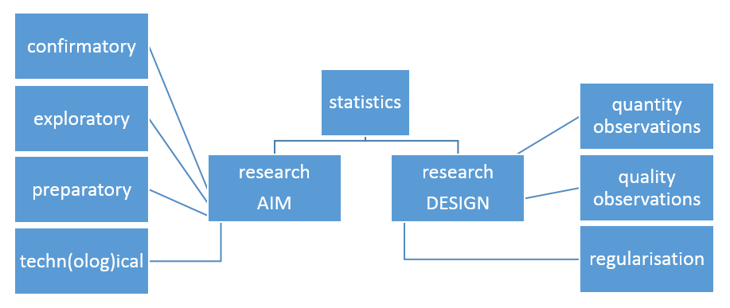
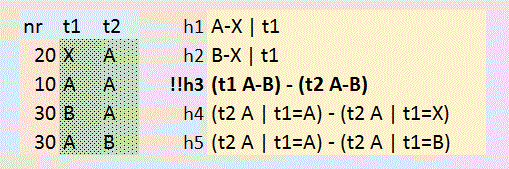

<!-- 
library(slidify)
setwd("C:\\Users\\wcools\\Documents\\ICDS\\website\\drafts")
slidify("methodology_slides.Rmd")
-->

<!--

ICDS website:
how to communicate your methodology and statistics in a research proposal

	Goal: 
	tips writing research proposals

	Wilfried Cools
	statistical consultant ICDS
	wilfried.cools@vub.be
	02 477 44 44

-->

<!-- RUN:: working directory and libraries -->

### Why and What
   
- convince referees (and yourself):  study should be successful, effective and efficient
- some reviewers are statisticians
- document (pdf/html) 'how to communicate methodology in research proposals'
- should be 'methodological and statistical issues to communicate in a research proposal'
- info session to discuss that document

--- article

### Disclaimer
   
- updated and refined in future, you can help us
- does not pretend full coverage
- reflects our own views, not necessarily the views of other reviewers
- should be used only for guidance, not as argument nor proof

---

## Key Ingredients
   
* what is the aim of your study
* how is your study designed to achieve that aim
	

<!-- RESEARCH QUESTION -->

<!-- 
Ask questions your research can provide answers for !  

make explicit
  
- the research questions  
questions, not stories, not a description of results, check the Net on how to 
focus: specify - a limited number - and be specific, do not look for anything
- the results -at a minimum- for a successful study (eg., significant difference)  
show that they are interesting and obtainable
- what are the expected results (eg., treatment outperforms control, an accurate estimate of the influence of age, ...)
boasts on the potential of your study

the research aim determines how you justify the study, the implications and requirements.
-->

---

## Research Aim
   
- ask questions your research can provide answers for
	- if general, also operationalize
- focus, specify the main questions 
- specify results -at a minimum- for a successful study
	- interesting & obtainable
- describe expected results
   
- aim partly determines justification
	- confirmatory / exploratory / preparatory / techn(olog)ical
	- quantitative / qualitative
	- inferential / descriptive

<!--
---

### Different Purposes
   
- a tentative distinction to bring focus in your arguments
	- confirmatory
	- exploratory
	- preparatory
	- technical / technological
	- ?

- other possible distinctions
	- quantitative versus qualitative
	- inferential versus descriptive
-->

---

<!--

- reason: confirm an expected difference, relation, ... (you know what you are looking for)
- focus: statistical test or parameter estimate with pre-specified confidence bounds
- requirement:
	- sample size calculation (for statistical testing or estimation)
		- primary hypothesis & minimum aim
	- link research design and primary aim
	- statistical analysis plan
		- main techniques for analyzing primary and secondary hypotheses
	- discuss cost (eg., risks, money, time, ...) and availability
- minimum: significant effect / sufficient accuracy for primary hypotheses
  
note:
- superiority versus non-inferiority and non-equivalence
- some more details: workshop on sample size calculation with gpower (see website)

-->

### CONFIRMATORY (purpose A)
  
- goal:: <strong>confirm</strong> an expected difference, relation, ... 
- focus:: statistical <strong>test</strong> or accurate parameter estimate
- requirement::
	- <strong>sample size</strong> calculation
	- discuss costs and availability of observations
	- link research design and primary aim
	- statistical analysis plan
- minimum:: <strong>significant effect</strong> / sufficient accuracy for primary hypotheses
 
- note:: superiority versus non-inferiority and non-equivalence

---

<!--

- goal:: to explore
- focus A:: data description and/or parameter estimation
	- testing/accuracy is typically not the primary aim, but could be secondary
- focus B:: qualitative understanding
- focus C:: predictive modeling, hierarchical clustering, ..., implies cross-validation
- requirement:: 
	- justify the need/importance of extracted information on substantive grounds
	- sample size -justification-, argue the balance informational value versus cost
	- link research design and most important information of interest
	- statistical analysis plan
- minimum:: could be many things, as long as you can sufficiently argue its merit
  
note: study should be of interest without significant/accurate enough results !

-->

### EXPLORATORY (purpose B)
  
- goal:: to <strong>explore</strong>
- focus A:: data description and/or parameter estimation
	- testing/accuracy could be secondary aim, only
- focus B:: qualitative understanding
- focus C:: predictive modeling or numerical techniques (eg., cluster analysis)
- requirement:: 
	- sample size -justification-, argue balance information - cost
	- justify on <strong>substantive</strong> grounds, NOT on significance
	- link research design and most important information of interest
	- statistical analysis plan
- minimum:: 
	- could be many things, as long as you can sufficiently argue its merit
	- note, study should be of interest without significant/accurate enough results !

---

<!--

- reason: to collect data (and monitor procedures) in preparation of -future- studies
- justification: the need for such information & value of the -future- studies
- focus: small scale set-up to show the potential and/or detect issues
	- phase I and II clinical designs
		- requires decision criteria to proceed or not
	- pilot study: implementation of future study
		- no statistical testing
		- not in itself of interest, not intended for publication
		- could be (partially) qualitative
- requirement: 
	- minimal cost to get rough idea (eg., 3 observations per condition)
	- not necessarily including all aspects of future study
- minimum: ensures information required for future study

-->

### PREPARATORY (purpose C)
  
- goal:: prepare or justify <strong>future</strong> study
- focus: small scale set-up to show the potential and/or detect issues
	- phase I and II clinical designs
		- requires decision criteria to proceed or not
	- pilot study: implementation of future study
		- no statistical testing
		- not in itself of interest, not intended for publication
		- could be (partially) qualitative
		- could be simply monitoring procedures (not a mini-copy)
- requirement:: 
	- justify the need for a preparatory study & value of the -future- studies
	- <strong>minimal cost</strong> to get rough idea (eg., 3 observations per condition)
- minimum: ensures information required for future study

---

### TECHN(OLOG)ICAL advancements  (purpose D)
  
- goal:: to design, engineer, create, ...
- focus:: rarely any statistics involved
- requirement:: methodology not related to quantitative research
	- justification based on expected contribution versus costs, not statistics 
		- proof of concept: feasibility
		- proof of principle: functionality
		- development application
- minimum:: particular state of advancement, improvement

---

<!--

- quantitative
	- focus on quantifiable empirical aspects of subject of research
	- typically reduces complexity (operationalize to manage)
	- uses (ideally) representative samples
	- can be descriptive and/or inferential  
 
- qualitative (holistic/subjective)
	- focus on understanding of subject of research: reasons, opinions, motivations, ...
	- typically aims at embracing complexity
	- mostly descriptive, exploratory / hypothesis generating
 
- both require sufficient explanation of intended research process and product
  
note: 
- there is a continuum between the two and both can be used jointly/consecutively

-->

### Quantitative versus Qualitative
   
- quantitative
	- focus on quantifiable empirical aspects
	- typically reduces complexity (operationalize to manage)
	- can be descriptive and/or inferential  
 
- qualitative
	- focus on understanding: reasons, opinions, motivations, ...
	- typically aims at embracing complexity
	- only descriptive, exploratory / hypothesis generating

---

<!--

distinguishing between the sample and the population

- infer: 'population'
	- focus on population, aim at generalization
	- uses (ideally) representative samples
	- requires estimation of uncertainty, or use of it
 
- describe: 'sample'
	- focus on the observed data
	- present data as is
	- use no uncertainty of estimation, nor p-values
  
note:
- in the analysis inference usually is preceded by descriptions

-->

### Descriptive versus Inferential
   
- infer: 'population'
	- focus on population, aim at <strong>generalization</strong>
	- uses (ideally) representative samples
	- requires estimation of uncertainty, or use of it
   
- describe: 'sample'
	- focus on the observed data
	- present data as is
	- use no uncertainty of estimation, nor p-values

---

<!-- DESIGN / STATS -->

## Research Aim & Design
   
- design is strategy to reach your aim data collection, measurement, intended analysis
	- specifies how (potential) observations are related
	- influences type of elicited information
   
- popular saying: garbage in... garbage out !
	- poor design makes study inefficient or even invalid
	- statistics can not solve design problems   

---

<!-- DESIGN / STATS -->

## Research Design
     
- sufficient sample size (quantity)
- quality dependent on 
	- conditions of observation, eg., cross-over
	- method of observation, eg., quality of life score
- generalization dependent on 
	- selection of research units
	- missing observations
- allowing appropriate statistical analysis

---

<!--

observations provide information but involve a cost (money, time, ethical concerns, ...)   
sample sizes are determined depending on the type of research (calculate / justify / minimal)

the sample size -calculation- requires information on:
- the statistical test in focus (eg., t-test for independent groups at the end of the study)
- the effect size aimed for (eg., .5: difference > 2, assume pooled standard error of 4)
	- effect: ideally specified on substantive grounds, or common practice / earlier research
	- uncertainty: should ideally be based on earlier data/research or pilot
- the operational characteristics (type I error $\alpha$ and type II error $\beta$)
  
issues:
- sample sizes are always obtained for -future- studies (not retrospective)
- sample sizes only determined for primary research questions (take highest when multiple)
  
note: an equivalent notion in qualitative research is saturation, explain how you evaluate it

-->

### Quantity of Observations
   
- observations provide information and involve a cost
	- as many observations as possible, but...
 
- when confirmatory, sample size -calculation- requires information on:
	- statistical test in focus
	- effect size aimed for
		- effect: ideally specified substantively, or common practice / earlier research
		- uncertainty: ideally based on earlier data/research or pilot
	- operational characteristics (type I error $\alpha$ and type II error $\beta$)
	- issues:
		- only for -future- studies (not retrospective)
		- only for primary research questions (take highest when multiple)

---

<!--

a general principle is to

- control confounding variables (influence not in the model)
- maximize systematic variability (explained variance)
- minimize non-systematic variability (unexplained variance)

note: isolate the effect of interest either by avoiding or measuring unwanted influences

optimization to large extent requires control
- experimental study exerts control (necessary condition for causal conclusions)
- observational study does not exert control
	- retrospective
	- naturalistic
	- survey
	- and more ...

-->

### Quality of Observations
   
- depends on conditions & method
   
- general principle 
	- control confounding variables (influence not in the model)
	- maximize systematic variability (explained variance)
	- minimize non-systematic variability (unexplained variance)
   
- often requires control
	- experimental study exerts control
		- necessary condition for causal conclusions
	- observational study does not exert control
		- retrospective, naturalistic, survey, ...

---

<!--
   
- control on confounding variables
	- randomization to balance out various disturbances
	- blocking (compare observations with others within a block, homogeneous disturbance)
	- repeated measures (compare observations on the same unit, different time points)
	- matching (create similar groups, except for the main effect in consideration)
	- cross-over designs (alternate treatments within a unit of observation) 
	- contra-balancing (estimate order effects)
	- (double-) blinding (avoid influence experimenter/interviewer/...)
	- and more ...
   
clearly, control over the conditions of observation is implied
-->

### Quality of Observations --- Confounders
   
- control on confounding variables
	- randomization (large enough sample size)
	- repeated measures
	- blocking
	- matching
	- cross-over designs
	- (double-) blinding
	- and more ...
 
- typically complicates statistical analysis
	- correlational structure

---
<!--

- maximize systematic variability
	- use proper explanatory variables (correct'ish model)
	- use maximally differentiating conditions (variable levels)
		- beware: not too extreme; artifacts, simplifications
   
- minimize non-systematic variability
	- maximize systematic variability
	- use proper measurement tools
		- high reliability / precision, maybe check first
		- combine measurement tools (estimate reliability)
		- use categories when necessary only, continuous if possible

-->

### Quality of Observations --- (Non-) Systematic Variability
 
- maximize systematic variability
	- use proper explanatory variables
	- use maximally differentiating conditions
		- beware: not too extreme
   
- minimize non-systematic variability
	- maximize systematic variability
	- use proper measurement tools
		- high reliability / precision, maybe check first
		- combine measurement tools (estimate reliability)
	- use categories when necessary only, continuous if possible

---

<!--

generalization (inference) dependent on successful sampling  

-	method of sampling (size / representativeness)
-	missing data (reason / how to avoid or deal with it)

types of sampling  

- probabilistic (sampling: random, stratified, cluster, multi-stage, ....)
- non-probabilistic (sampling: diversity, expert, ....)

note: a 'random sample of elderly patients that you know personally' strictly does not allow for generalization to young patients, non-patients, unknown patients 
unless you are willing to assume it does

-->

### Generalizability
 
- generalization (inference) dependent on successful sampling  
	-	method of sampling
	-	missing data
		- avoid
		- remediate
   
- types of sampling  
	- probabilistic (sampling: random, stratified, multi-stage, ....)
	- non-probabilistic (sampling: diversity, expert, ....)
   

<!--
---

### Example

The aim is to show that the proposed treatment is an improvement over the current standard method. 

Participants are randomized into two groups, treatment and control. The control group is given a dummy treatment. A post experiment survey addresses whether participants were aware about dummy treatment. Each participant is measured once, immediately after the (dummy) treatment was administered which results in one score per patient, continuous on a 0-10 scale. A t-test for independent means is used to evaluate whether the scores in the treatment group are higher than those in the control group. 

A sample size was derived for the t-test to detect a minimal difference of 2 in favor of the treatment, which was decided upon by our expert panel. In literature, the standard method is indicated to have a population standard deviation of about 4. Because no information is available on the new treatment it is assumed that the same population standard deviation applies. This leads to a sample size of 51 patients in each of both groups, required for a one-sided test, type I error of .05 and power of .8. Earlier experiments showed a drop-out of about 10%, so 51/9*10 < 57 patients are included per group. 
-->

---

<!--
### From observation to information to conclusion

observations provide information that is used to 

- test (signif.) - estimate (confidence int.) - predict (cross validate) - understand (qualitative)

to evaluate how to extract the required information and what can concluded based on it.

- how many observations (~ amount of information)
- what is the unit of analysis (eg., patient, test score at a given time, ...)
- how are the units of analysis allocated to the conditions (random, blocked, ...)
- how are the units of analysis selected from the population (random, stratified, ...)
- is the unit of analysis measured repeatedly (between / within)
- what are the possible observations (eg., positive continuous, low-medium-high, ...)
- which observations are most likely (eg., very many zero's, occasionally extreme, ...)
- is the design balanced (same number of observations in each condition, at each time point)
- ...

-->

## Statistics

<!--

introduce the statistics that are planned

- in agreement with design
- able to answer the research questions vital for your study
	- highlight how it answers your question (p.value, confidence, successful prediction, ...)
- promising to answer your secondary research questions
- while acknowledging foreseeable challenges

example:  
test whether treatment is not worse with 1 point on the scale compared to the control so p-value for non-inferiority <.05 with margin 1 deviations from, normality often observed, dealt with using log-transformations

- note: sample size calculations are not a part of the statistical plan
- note: give the resulting data file serious thought, do not just observe and fail to analyze

-->

   
- observations provide information that is used to 
	- test (signif.), estimate (confidence int.), predict (cross validate)
   
- introduce the statistics that are planned
	- in agreement with design
	- able to answer the main research questions (highlight how)
	- promising to answer secondary research questions
	- while adhering to foreseeable challenges
		- eg., small sample sizes, difficult distributions, ...
 
- notes:
	- sample size calculations are not a part of the statistical plan
	- give the resulting data file some serious thought

---

## Practical Suggestions
   
- isolate methodological and statistical issues from substantive reasoning
- use consistent labeling
- visualize wherever possible
	- data collection process (time-line)
	- categories of observations and their relation
	- show design with tables list all conditions between (rows) and within (columns)  
		
	- 

---

## Conclusion
</img>
   
   
   
   
   
- many methodological and statistical issues, some may be relevant
- convince yourself that your study is appropriate
- be clear on your aim and how to be successful (research design)
- convince the committee that your study is appropriate
- for support, maybe turn to ICDS 
  

---

## </img><icds>Interfaculty Center Data processing & Statistics</icds>
<strong>Methodological and statistical support to help make a difference</strong>

- <small>ICDS provides complementary support in methodology and statistics to our research community, for both individual researchers and research groups, in order to get the best out of them</small>

- <small>ICDS aims to address all questions related to quantitative research, and to further enhance the quality of both the research and how it is communicated</small>

website: https://www.icds.be/  
<small>includes information on who we serve, and how </small> 
booking: https://www.icds.be/consulting.php  
<small>for individual consultations</small>
